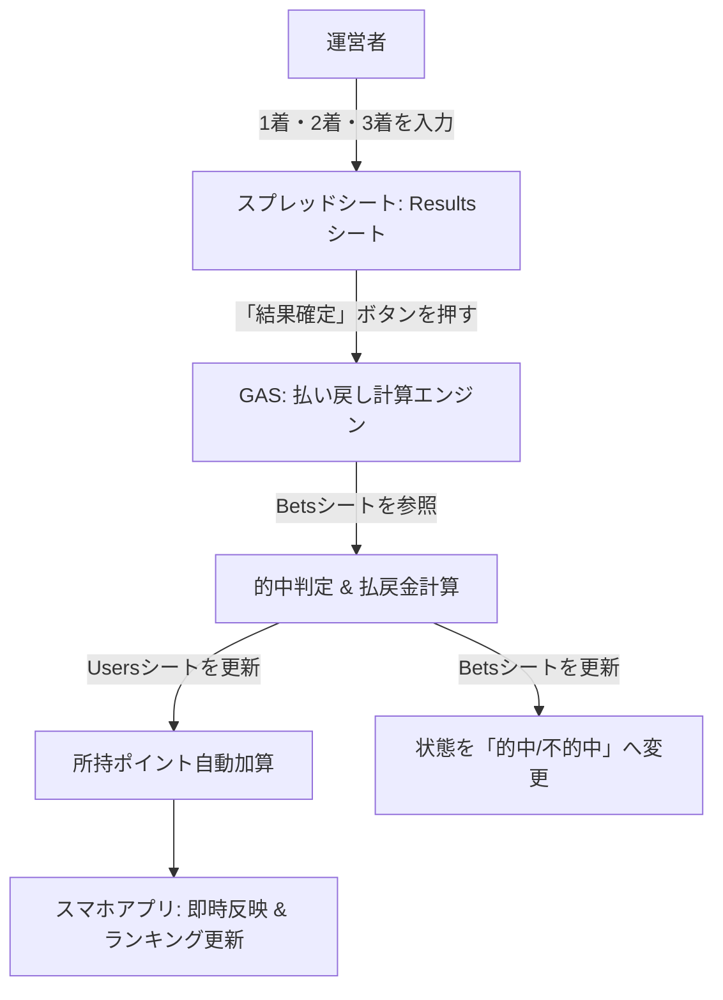

# 陸上ダービーシステム：券種拡張＆自動払戻システム 構想設計書

本書は、陸上ダービーシステムにおいて**「単勝」「複勝」「ワイド」等の多様な賭け方（券種）に対応するデータ構造**および**「レース結果入力からポイントの自動計算・配分（払い戻し）を行うシステム」**の構想設計書です。

非エンジニアの運営者でも、スプレッドシートに「1着・2着・3着」を入力するだけで全自動で配金が完了する仕組みを提示します。

---

## 1. 全体アーキテクチャ概要



---

## 2. スプレッドシートの設計構想

運営の手間を最小限にするため、シート役割を明確に分離します。

### (1) `Races` シート (出走表・オッズ)
各選手の単勝・複勝オッズを保持します。

| レースID | レーン | 選手名 | 持ちタイム | 発走時刻 | 種目名 | 単勝オッズ | 複勝オッズ |
|---|---|---|---|---|---|---|---|
| 1 | 1 | ヤマダ | 10.5 | 12:00 | 男子100m | 2.5 | 1.2 |
| 1 | 2 | サトウ | 10.7 | 12:00 | 男子100m | 4.0 | 1.5 |
| 1 | 3 | スズキ | 10.9 | 12:00 | 男子100m | 8.5 | 2.8 |

> **ワイドオッズについて**: 
> ワイドオッズは組み合わせ数が多いため、「固定倍率（例: 一律3.0倍など）」にするか、事前に入力する別テーブルを用意するかを選択できるようにします。

---

### (2) `Results` シート (結果入力シート) ★運営用
レース終了後、**運営者が入力するのはこのシートのみ**です。

| レースID | 種目名 | 1着選手 | 2着選手 | 3着選手 | ステータス | 確定実行 |
|---|---|---|---|---|---|---|
| 1 | 男子100m | ヤマダ | スズキ | サトウ | 未確定 | [結果確定] |

- **ステータス**: `未確定` ➔ 処理完了後に `確定済` に自動変更。

---

### (3) `Bets` シート (ベット履歴)
ユーザーがアプリから賭けた内容が自動記録されます。

| 日時 | カタカナ名 | レースID | 券種 | 選択対象1 | 選択対象2 | 賭けたpt | 払戻倍率 | 状態 | 払戻pt |
|---|---|---|---|---|---|---|---|---|---|
| 2026/08/26 11:50 | イトウマコト | 1 | 単勝 | ヤマダ | - | 500 | 2.5 | 受付済 | 0 |
| 2026/08/26 11:52 | イトウマコト | 1 | ワイド | ヤマダ | スズキ | 300 | 5.0 | 受付済 | 0 |

- **券種**: `単勝`, `複勝`, `ワイド`
- **選択対象1 / 2**: 単勝・複勝は「対象1」のみ使用。ワイドは「対象1」「対象2」を使用。

---

## 3. 券種（ベットタイプ）ごとの的中判定ルール

| 券種 | 賭け方の概要 | 的中条件 | 払い戻しポイント計算 |
|---|---|---|---|
| **単勝** | 1着の選手を当てる | 選択対象1 == `1着選手` | `賭けたpt × 単勝オッズ` |
| **複勝** | 3着以内に入る選手を1名当てる | 選択対象1 in `{1着, 2着, 3着}` | `賭けたpt × 複勝オッズ` |
| **ワイド** | 3着以内に入る2名のペアを当てる（順不同） | 選択対象1 in `{1着, 2着, 3着}`<br>かつ 選択対象2 in `{1着, 2着, 3着}` | `賭けたpt × ワイドオッズ` |

---

## 4. 自動結果確定＆ポイント配分システム (GASロジック)

スプレッドシートのカスタムメニュー、またはボタン1つで起動するロジック構想です。

```javascript
/**
 * 運営者が実行する結果確定＆自動払い戻し処理
 */
function processRaceResults() {
  const ss = SpreadsheetApp.getActiveSpreadsheet();
  const resultsSheet = ss.getSheetByName('Results');
  const betsSheet = ss.getSheetByName('Bets');
  const usersSheet = ss.getSheetByName('Users');
  const racesSheet = ss.getSheetByName('Races');

  // 1. 未確定のレース結果を取得
  const resultsData = resultsSheet.getDataRange().getValues();
  // (ループ処理で ステータス === '未確定' のレースを特定)
  
  // 2. 確定対象レースの 1着・2着・3着 を取得
  const winner1 = "ヤマダ";
  const winner2 = "スズキ";
  const winner3 = "サトウ";
  const top3 = [winner1, winner2, winner3];

  // 3. Betsシートを走査し、対象レースのベットを判定
  // - 単勝判定: bet.target1 === winner1
  // - 複勝判定: top3.includes(bet.target1)
  // - ワイド判定: top3.includes(bet.target1) && top3.includes(bet.target2)

  // 4. 的中した場合:
  // - 払戻金額 = 賭けpt * オッズ
  // - Usersシートの対象ユーザーの「所持ポイント」に払戻金額を加算
  // - Betsシートの状態を「的中」、払戻ptを記録

  // 5. 不中的の場合:
  // - Betsシートの状態を「不的中」に更新

  // 6. Resultsシートのステータスを「確定済」に変更
}
```

---

## 5. Webアプリ UI (index.html) の拡張イメージ

スマホ画面での操作性を損なわない洗練されたインターフェース：

1. **券種切り替えタブ**:
   レースカード内に `[単勝]` `[複勝]` `[ワイド]` の切替タブを配置。
2. **ワイド選択モード**:
   ワイド選択時は、出走選手一覧から **「2名タップして選択」** できるインディケーターを表示。
3. **オッズの動的表示**:
   選択した券種に応じて、画面上のオッズ表示が「単勝オッズ」「複勝オッズ」にリアルタイム切り替え。

---

## 6. 導入スケジュール（フェーズ案）

* **Phase 1 (現在完了)**: 単勝の基本ベット、ログイン、リアルタイムカウントダウン、アコーディオン、履歴・キャンセル、ランキング表示。
* **Phase 2 (次回アップデート)**: 
  1. スプレッドシートに `Results` シートを作成し、配金ロジック（GAS）を導入。
  2. `index.html` に「複勝」「ワイド」の選択UIを追加。

---
*作成日: 2026年8月26日*  
*作成者: Antigravity AI Team*
